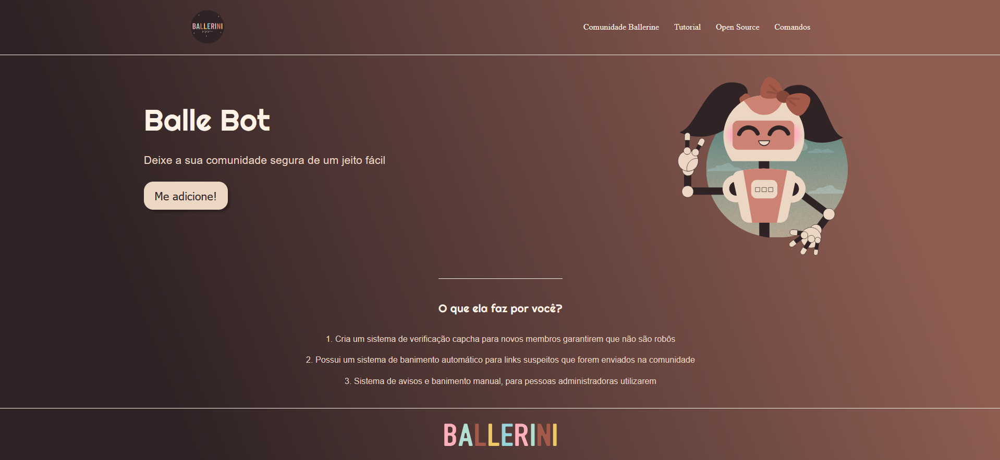

# 🤖 BalleBot - Landing Page

 <!-- Substitua ou remova se não tiver um screenshot -->

## 📘 Sobre o Projeto

**BalleBot** é uma landing page criada com fins de aprendizado. O projeto tem como objetivo demonstrar a construção de uma página responsiva e esteticamente agradável utilizando tecnologias modernas da web.

Este projeto foi uma forma prática de aprendizado para quem está iniciando no desenvolvimento front-end.

## 🛠️ Tecnologias Utilizadas

- HTML5
- CSS3

## 🚀 Como Visualizar

Você pode visualizar a landing page diretamente clicando aqui: https://edwardlacerda.github.io/LandingPage/
